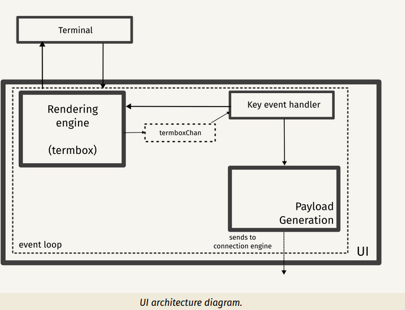
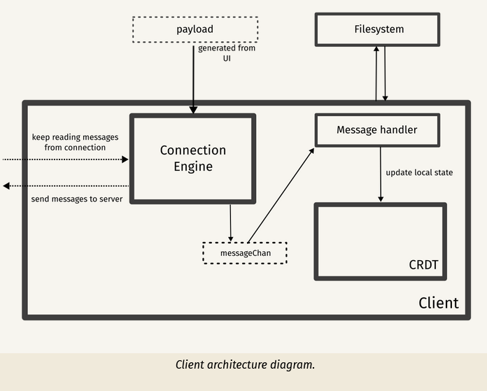
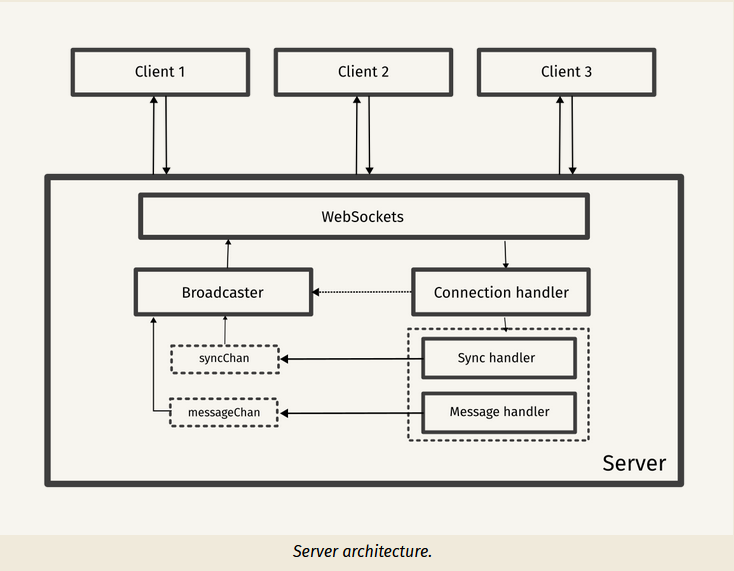
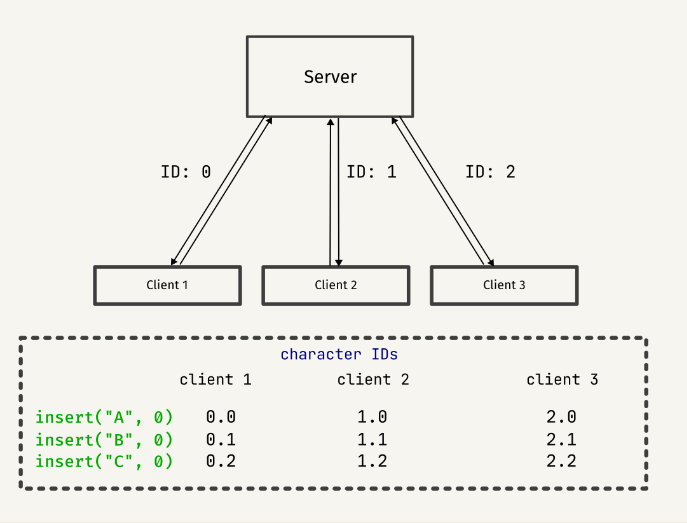

# Group Members

| No  | First Name | Last Name | ID          | Section |
| --- | ---------- | --------- | ----------- | ------- |
| 1   | Samuel     | Godad     | UGR/4642/13 | 2       |
| 2   | Fedasa     | Bote      | UGR/6761/13 | 2       |
| 3   | Addisu     | Abitew    | UGR/7259/13 | 1       |
| 4   | Basliel    | Amsalu    | UGR/8569/13 | 2       |
| 5   | Firaol     | Bogale    | UGR/4642/13 | 2       |

# Text-Collab: A Collaborative Text Editor

## Introduction

Text-Collab is a collaborative text editor built from scratch in Go, aimed at providing real-time collaboration capabilities for multiple users editing the same document simultaneously.

## Key Concepts

### Text Editors

At its core, Text-Collab operates as a typical text editor, offering features such as cursor movement, text selection, copy and paste, and various text formatting options. It employs efficient data structures to manage the text content, enabling dynamic insertion and deletion of characters without extensive shifting.

### Collaboration Challenges

Multi-user text editing introduces complexities such as conflict resolution, real-time coordination, and synchronization among participants. Text-Collab addresses these challenges to ensure a seamless collaborative editing experience.

## Conflict-Free Replicated Datatypes (CRDTs)

Text-Collab utilizes Conflict-Free Replicated Datatypes (CRDTs) as an approach for collaborative text editing. CRDTs enable decentralized synchronization of document changes among multiple users, ensuring eventual consistency without the need for conflict resolution.

## Next Steps

## Architecture

### User Interface (UI)

The user interface is a text-based user interface (TUI) built using the Go port of termbox, a minimal alternative to ncurses.

Each keystroke is consumed by termbox and is registered as a termbox event. This event is sent to a channel called termboxChan.

This channel is the main “pipeline” of any UI-related events. All events from this channel are consumed by the “key event handler,” which processes the event and performs operations based on the key. Operations include cursor movements, performing editor operations, and payload generation, which includes the generation of a JSON payload sent to the client’s connection engine.

### Client Architecture

The payload sent from the event handler is now parsed by the connection engine, the component responsible for communicating with the server. A goroutine keeps listening for any messages from the WebSocket connection and sends the message to the message channel (messageChan).

These messages are parsed by the message handler, which checks the message type and performs a suitable action on the local document (CRDT). This will be discussed in detail later.

### Server Architecture

The server is a hub that broadcasts messages to all connected clients. All clients connect to the server using WebSockets, and the server maintains a list of all connected clients.

The server broadcasts all operations sent by a client to all connected clients. It also helps in managing a document synchronization request, wherein a client asks for the current copy of the editing session to be in sync with other clients.

When a client connects to the server, we generate a site ID for that client and add that client to the list of connected clients. We send a site ID “message” to that client to let it know its ID. This site ID is used by the client for constructing the unique identifier for a character: <SiteID><LocalClock>. In the diagram, character ID is represented as <SiteID>.<LocalClock> for better readability.

### Document sync protocol

When a client connects to the server, it has no idea on the existing state of the other clients, so it sends a docReq message to request the current document state from one of the other clients.

Once the docReq message is received by the client, it responds by sending a docSync message containing the entire document content. This message is sent to the client that requested the document, helping it sync to the current state.

...

## Features

- **WOOT CRDT Implementation:** The Editor uses WOOT, a simple sequence CRDT, to manage concurrent edits efficiently. Each character in the document is represented as a W-character with unique identifiers, ensuring seamless collaboration.

- **Basic Text Editing Operations:** The Editor supports local insertions and integrates insertions from other sites using the WOOT algorithm. Deletions are handled by marking characters as deleted without directly removing them.

- **Terminal User Interface (TUI):** The user interacts with editor through a TUI, allowing for a simple and efficient editing experience. The TUI supports various key commands for actions like saving, loading, and exiting.

- **Broadcasting and Synchronization:** The server acts as a hub for broadcasting messages to all connected clients. Editor implements a document sync protocol where clients can request and synchronize the current state of the document.

- **WebSockets for Real-time Communication:** Editor uses WebSockets to facilitate bidirectional, full-duplex communication between the server and clients. This ensures real-time updates and efficient collaboration.

## Key Commands

| Action               |             Key             |
| -------------------- | :-------------------------: |
| Exit                 |       `Esc`, `Ctrl+C`       |
| Save to document     |          `Ctrl+S`           |
| Load from document   |          `Ctrl+L`           |
| Move cursor left     | `Left arrow key`, `Ctrl+B`  |
| Move cursor right    | `Right arrow key`, `Ctrl+F` |
| Move cursor up       |  `Up arrow key`, `Ctrl+P`   |
| Move cursor down     | `Down arrow key`, `Ctrl+N`  |
| Move cursor to start |           `Home`            |
| Move cursor to end   |            `End`            |
| Delete characters    |    `Backspace`, `Delete`    |

## Testing

The testing process for this text editor is straightforward and efficient. We initiate the process by launching both the server and the client. Once these are up and running, we establish a connection to the server. With the connection in place, we can begin editing the document. The real-time nature of the editor allows us to observe changes instantaneously as they occur. However, due to constraints on our time, we have limited our testing scope to local instances of the editor.
